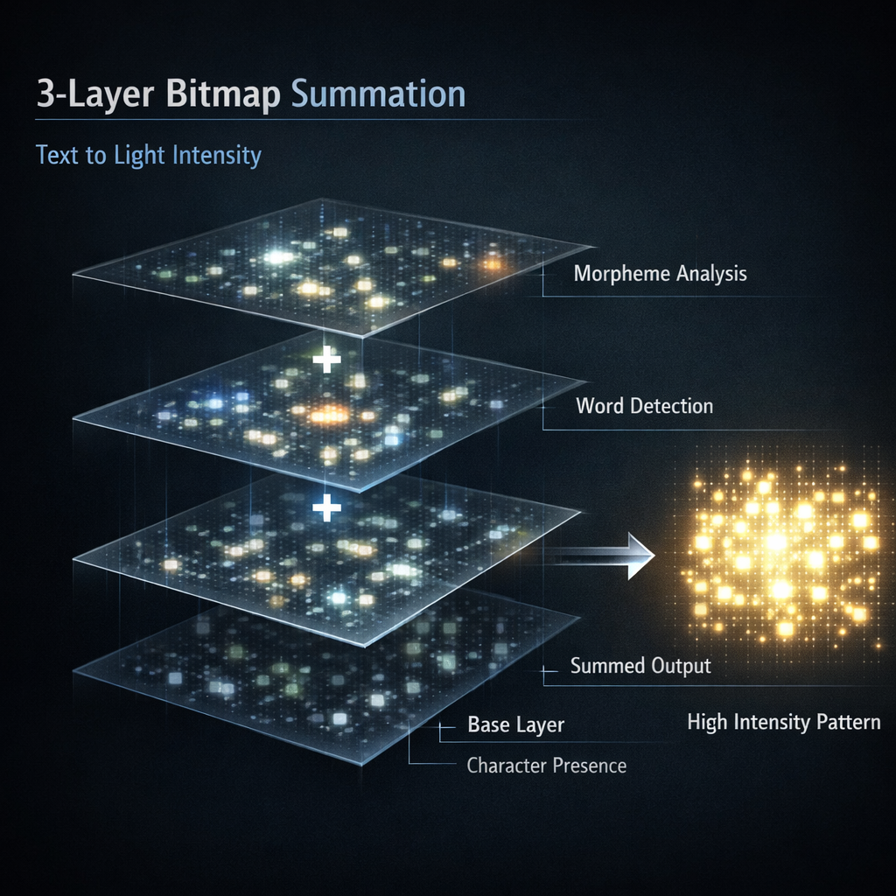

# SPATIAL-PATTERN-AI (CANVAS)


> A spatial pattern–based AI engine that encodes text as brightness patterns
> on a 256×256 RGBA grid. Language is treated like video frames, not token
> vectors — matching, generation, and compression all fall out of image
> operations on the resulting bitmaps.

```
 "The cat eats rice."          256×256 Grid  (1 clause = 1 frame)
         │                    ┌────────────────────────┐
    UTF-8 bytes               │  ·                     │
         │                    │    ·  ·                │
   ┌─────▼──────┐             │  · · ·  ·   ·         │
   │ X = byte    │             │     ·    ·            │
   │ Y = position│  ──────►   │  ·    ·                │
   │ A = 3-layer │             │       ·  ·            │
   │     sum     │             │  · ·       ·  ·       │
   └─────────────┘             └────────────────────────┘
                                A channel: byte-frequency heatmap
```

---

## Table of contents

- [Why this exists](#why-this-exists)
- [How it works](#how-it-works)
  - [1. Three-layer bitmap summation](#1-three-layer-bitmap-summation)
  - [2. RGBA channels](#2-rgba-channels)
  - [3. Keyframe / Delta storage](#3-keyframe--delta-storage)
  - [4. Matching cascade](#4-matching-cascade)
  - [5. Top-K + character-span refinement](#5-top-k--character-span-refinement)
  - [6. Canvas pool with slot reordering](#6-canvas-pool-with-slot-reordering)
- [Build & run](#build--run)
- [Tests & verifiers](#tests--verifiers)
- [Save / load](#save--load)
- [Project layout](#project-layout)
- [Documented divergences from SPEC](#documented-divergences-from-spec)

---

## Why this exists

Classical language models compress semantics into opaque float vectors that
only make sense to another model. This engine compresses the same semantics
into an **interpretable 256×256 image** per clause, where:

- the X axis is the byte value (0–255)
- the Y axis is the byte position inside the clause
- the A channel is how strongly that (position, byte) was hit by the
  3-layer weighting
- the R/G/B channels carry part-of-speech priors that converge across
  the corpus via EMA

Because it's a bitmap, every step is visual. You can feed the canvas
straight into H.264-style scene-change detection and delta-RLE
compression — which is exactly what the keyframe/delta and canvas
pool layers do.

---

## How it works

### 1. Three-layer bitmap summation



Each clause is encoded into three separate 256×256 bitmaps. They stamp the
same byte positions with different weights, then sum into the A channel of
the final grid.

| Layer | Grain | Weight | What it captures |
|-------|-------|--------|------------------|
| **Base** | every byte | **+1** | raw byte frequency per position |
| **Word** | space-separated tokens | **+5** | word-level emphasis (substitutable units) |
| **Morpheme** | dictionary morphemes (content POS only) | **+3** | root / stem boundaries |

```
A_sum(y, x) = base(y, x) + word(y, x) + morpheme(y, x)     (clamped to uint16)
```

The morpheme layer **only stamps content morphemes** (noun / verb / adjective /
unknown) — particles and endings stay at base weight. See
[documented divergences](#documented-divergences-from-spec) for why.

### 2. RGBA channels

A carries byte frequency. R / G / B carry **part-of-speech priors** that
converge as training progresses, via three mechanisms layered on top of
each other:

**1. POS seed** (`seed_morpheme_rgb`) — each morpheme's POS picks a starting
R, G, B triple. Same POS → same starting color.

| POS | R | G | B |
|-----|---|---|---|
| NOUN | 40 | 30 | 100 |
| VERB | 120 | 40 | 140 |
| ADJ | 170 | 35 | 180 |
| PARTICLE | 8 | 85 | 90 |
| ENDING | 6 | 95 | 110 |
| PUNCT | 5 | 120 | 60 |
| UNKNOWN | 210 | 20 | 200 |

**2. Directional diffusion** (`update_rgb_directional`) — per clause, each
active cell is pulled toward its neighbors' color. The direction of
diffusion encodes which kind of co-occurrence is being captured:

| Channel | Direction | Co-occurrence captured |
|---------|-----------|------------------------|
| **R** | diagonal ↗↘↙↖ | morpheme combinations (root + particle) |
| **G** | vertical ↑↓ | word substitution (same position, alternative word) |
| **B** | horizontal ←→ | intra-clause byte order / inter-slot flow |

**3. Cross-clause EMA** (`ema_update`) — every (y, x) cell accumulates a
running mean R/G/B over all clauses it has been active in. Subsequent
encodes blend that mean back in (`apply_ema_to_grid`); cells with fewer
than 2 observations are left alone.

### 3. Keyframe / Delta storage

Every clause becomes either a full **I-frame** or a sparse **P-frame** delta.
`ai_store_auto` decides based on cosine similarity against the best existing
keyframe:

```
clause → layers → RGB diffusion → EMA blend
   │
   ├─ topic_bucket_best_match (same-topic linear scan, cheap)
   └─ if best_sim < 0.30 → spatial_match(MATCH_SEARCH) cascade

if best_sim ≥ 0.30:    store as DeltaFrame(parent_id = best_kf)
else:                  store as new Keyframe, bucket_index_add, ema_update
```

Threshold is runtime-tunable via `ai_set_store_threshold(t)` — wiki-style
corpora with redundant abstracts benefit from lower values (0.15).

Structures:

```c
Keyframe   { id, label, SpatialGrid grid, topic_hash, seq_in_topic };
DeltaEntry { index, diff_A (i16), diff_R/G/B (i8) };   // 9 bytes, sparse
DeltaFrame { id, parent_id, entries[], count, change_ratio };
```

`apply_delta(base, entries, count, out)` reconstructs the target grid cell
by cell with clamped per-channel addition.

### 4. Matching cascade

All retrieval goes through one function, `spatial_match`, with three modes:

| Mode | Scoring | Used for |
|------|---------|----------|
| `MATCH_SEARCH` | cascade (overlap → cosine) | keyframe vs delta decision |
| `MATCH_PREDICT` | RGB-weighted cosine | next-frame generation / top-K retrieval |
| `MATCH_GENERATE` | A × B × G blend | extended-channel pair lookup |

Each mode returns the same `MatchResult { best_id, best_score, topk[8], topk_count }`.
The cascade short-circuits: if the coarse 16×16 overlap is already below
threshold, the precise RGB-weighted cosine is skipped. A bucket index keyed
on the first few active cells (`BucketIndex`) keeps the candidate pool small
once `kf_count` passes the threshold.

### 5. Top-K + character-span refinement

`ai_generate_refine` completes a sentence from a prefix by aggregating the
top-8 retrieved keyframes' next-in-topic successors and walking the
aggregated grid as **UTF-8 character spans**, not independent byte rows.

```
1. encode input → MATCH_PREDICT top-K
2. for each k in top-K: ids_next[k] = ai_next_in_topic(ids[k])
3. build focused AggTables (score-weighted A/R/G/B means over ids_next)
4. seed candidate = top-1 next-in-topic grid (UTF-8-safe start)
5. refine loop, per character span (1/2/3/4 rows):
     score seed span under agg_score_byte_full
     for each top-K source: score its span; reject if UTF-8 width ≠ seed width
     apply morpheme stickiness bonus if prev character stayed in the same source
     commit the winning span atomically (no cross-source byte mixing)
6. decode via grid_decode_text_utf8
```

The character-span refinement is what keeps Korean output as valid Hangul —
per-row argmax swaps (pre-v4) mixed bytes across top-K candidates and
produced Frankenstein glyphs like `잌` / `쥸`. Verified on the 18-clause
Korean seed corpus via `make verify_refine`.

### 6. Canvas pool with slot reordering


Canvases hold up to 32 clauses in a 2048×1024 RGBA buffer arranged as an
**8×4 tile grid** (one 256×256 tile per slot):

```
+----+----+----+----+----+----+----+----+
| 0  | 1  | 2  | 3  | 4  | 5  | 6  | 7  |
+----+----+----+----+----+----+----+----+
| 8  | 9  | 10 | 11 | 12 | 13 | 14 | 15 |
+----+----+----+----+----+----+----+----+
| 16 | 17 | 18 | 19 | 20 | 21 | 22 | 23 |
+----+----+----+----+----+----+----+----+
| 24 | 25 | 26 | 27 | 28 | 29 | 30 | 31 |
+----+----+----+----+----+----+----+----+
```

Placement is append-only during normal inserts (`canvas_add_clause` always
writes to `slot_count++`). **When a canvas fills up** (slot 32),
`canvas_reorder_slots` runs a greedy 2-opt pass before scene-change
classification:

- Cost per adjacent pair: `(topic_hash mismatch ? 1 : 0) + (1 - A_cosine)`
- Objective: minimize the sum over the 52 adjacent pairs (28 horizontal +
  24 vertical)
- Physical swap via a scratch buffer (cycle-safe)
- Permutation returned to callers so `SubtitleTrack` entries can be
  remapped (`subtitle_track_remap_canvas_slots`)

Reordered canvases have spatially coherent content → cross-boundary
B-channel diffusion (`canvas_update_rgb`) reinforces similar clauses, and
the canvas-level delta RLE compresses better. Measured reduction on the
round-robin test case: **~32% lower adjacent-pair cost** (32.24 → 21.79).

After reorder, canvases are classified `CANVAS_IFRAME` or `CANVAS_PFRAME`
by scene-change detection (16×16 block-sum deltas against other same-type
I-frame canvases in the pool).

---

## Build & run

```bash
# Build everything (library + 14 test binaries + 6 benches + tools)
make

# Full test suite
make test

# Clean
make clean
```

### Korean completion verifier

```bash
make verify_refine      # 18-clause Korean seed, side-by-side next vs refine
```

Sample output after the character-span refinement landed:

```
query   : "고양이가 밥을"
next    : "고양이가 매우 귀엽다."
refine  : "강아지가 밥을 는다다."

query   : "아이가 책을"
refine  : "어양이 책을 읽는다."   ← contains "읽"
```

### PR-level verifier (base_patterns + wiki5k + English)

```bash
make verify_pr2
```

Runs three sections:

- **A**: `data/base_patterns.txt` — checks top-K aggregation blends (≥2
  strong neighbors per query) and recovers predicates
- **B**: `data/wiki5k.txt` regression — trains on 1024 clauses, benchmarks
  `ai_generate_next` vs `ai_generate_refine` on 32 held-out prefixes (sim
  + wall time)
- **C**: `data/sample_en.txt` — English completion is ASCII-clean (no
  bytes ≥0x80) on 4 prefix queries; confirms character-span refinement
  is script-agnostic

### Interactive chat REPL

```bash
./build/chat --train data/wiki5k.txt --max 5000
# or load a saved model
./build/chat --load build/models/wiki5k.spai
```

### Streaming trainer

```bash
./build/stream_train --input data/sample_en.txt --max 50000 \
                     --save build/models/wiki50k.spai --verify
```

Accepts `--threshold 0.15` to bias toward delta storage on redundant corpora.

### Benchmarks

```bash
make bench
./build/bench_perplexity   data/sample_ko.txt
./build/bench_word_predict data/sample_ko.txt
./build/bench_qa           data/qa.tsv
./build/bench_stsb         data/stsb.tsv
```

---

## Tests & verifiers

14 test binaries built by `make test`:

| File | Covers |
|------|--------|
| `test_grid.c` | 256×256 RGBA grid primitives |
| `test_layers.c` | 3-layer summation, POS seeding |
| `test_match.c` | overlap / cosine / cascade |
| `test_cascade.c` | cascade wiring through `spatial_match` |
| `test_keyframe.c` | KF/Delta storage, threshold, apply_delta |
| `test_io.c` | `.spai` file I/O round-trips |
| `test_adaptive.c` | channel-weight adaptation |
| `test_context.c` | context-frame retrieval |
| `test_integration.c` | train → store → match end-to-end |
| `test_canvas.c` | canvas tile placement, delta RLE, **slot reorder** |
| `test_subtitle.c` | subtitle track + pool routing |
| `test_generate_refine.c` | top-K agg, pattern score, **character-span refinement**, stickiness |
| `tools/verify_refine.c` | Korean completion dump (18 clauses × 6 topics) |
| `tools/verify_pr2.c` | base_patterns + wiki5k + sample_en end-to-end |

---

## Save / load

```c
int        spatial_ai_save(const SpatialAI* ai, const char* path);
SpatialAI* spatial_ai_load(const char* path);
```

Format: `.spai` with a tagged trailing-record layout.

| Tag | Meaning |
|-----|---------|
| `0x01` | per-keyframe block (id, label, topic_hash, seq_in_topic, sparse grid) |
| `0x02` | per-delta block (parent_id, entries) |
| `0x03` | bucket index (skipped on load — rebuilt from keyframes) |
| `0x04` | channel weights |
| `0x06` | EMA tables (4 × GRID_TOTAL × float) |

Loading a v3 file into a v4+ binary is supported — missing records default
to zeros and the engine rebuilds derived state.

---

## Project layout

```
include/        public headers
  spatial_grid.h        256×256 RGBA primitives
  spatial_layers.h      3-layer encoder + POS seed
  spatial_match.h       directional diffusion + cascade
  spatial_keyframe.h    SpatialAI, Keyframe, DeltaEntry, EMA
  spatial_generate.h    AggTables, ai_generate_next/refine
  spatial_canvas.h      2048×1024 pool, 32 slots, reorder
  spatial_subtitle.h    SubtitleTrack + SpatialCanvasPool routing
  spatial_morpheme.h    Korean morpheme analyzer
  spatial_io.h          .spai serialization
  spatial_context.h     context-frame retrieval (QA)

src/            implementation (one .c per header)
tests/          14 test_* + 6 bench_* binaries
tools/          chat REPL, stream_train, verify_refine, verify_pr2,
                animate_training.py, visualize_training.py
data/           base_patterns.txt, wiki5k.txt, sample_en.txt
dict/           Korean morpheme dictionaries (nouns, verbs, adjectives,
                particles, endings)
SPEC.md         Full architectural spec (Korean)
SPEC-ENGINE.md  Engine optimizations spec
```

---

## Documented divergences from SPEC

The following implementation choices intentionally diverge from `SPEC.md`
after empirical testing:

- **Layer weights**: SPEC §3.1 prescribes `+1/+2/+1` (base/word/morpheme).
  Implementation uses `+1/+5/+3`. The preservation law
  (`A = base + word + morpheme`) holds regardless; higher weights give the
  word and morpheme layers stronger cosine contribution on short corpora.

- **Morpheme-layer gate**: SPEC §3.1 lists 어근/조사/어미 all as morphemes.
  Implementation stamps only content-POS morphemes (noun/verb/adjective/
  unknown) into the morpheme layer — particles, endings, and punctuation
  stay at base weight. Stamping function morphemes uniformly amplifies
  shared grammatical bytes (가/을/는다/.) across every Korean clause,
  which dominates aggregation and produces Frankenstein syllables on the
  18-clause seed. Verified empirically; commented in `pos_is_content`.

- **Refinement seed**: PR #2's description says "row-argmax under RGBA
  scoring". That was the pre-107fd28 behavior and produced byte-mixed
  output. The current implementation seeds from the top-1 next-in-topic
  grid (always UTF-8-valid) and relies on the **character-span**
  refinement loop to aggregate top-K sources at character granularity.
  Commented in `ai_generate_refine`.

- **POS_ENDING R seed** (now conforming): previously R=12 (in the
  concrete-noun range `[10, 49]`). Fixed to R=6 in the function-word
  range `[0, 9]` per SPEC §5.3.

---

## License

See `LICENSE`.
